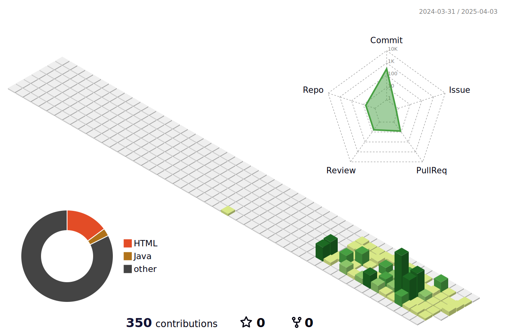

<!--
**eononenoe/eononenoe** is a ✨ _special_ ✨ repository because its `README.md` (this file) appears on your GitHub profile.
-->
# 👋 Hi there 
### 💪 I'm currently working on 
 
### 📡 I'm currently Top Languages 
 
### 📚 Language use 

     
     
     
     
     
     
     
     

 

